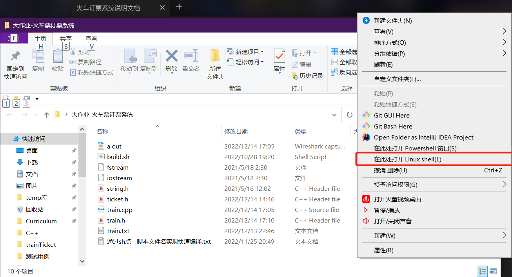
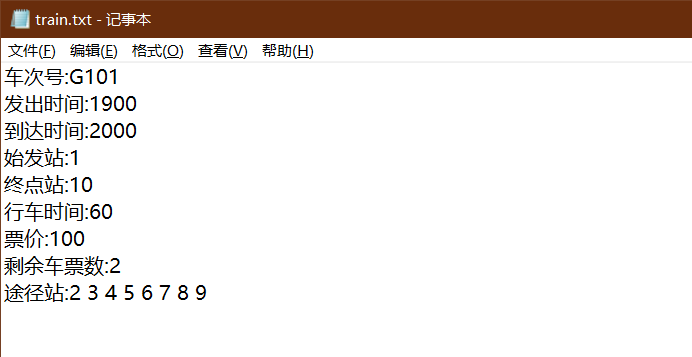
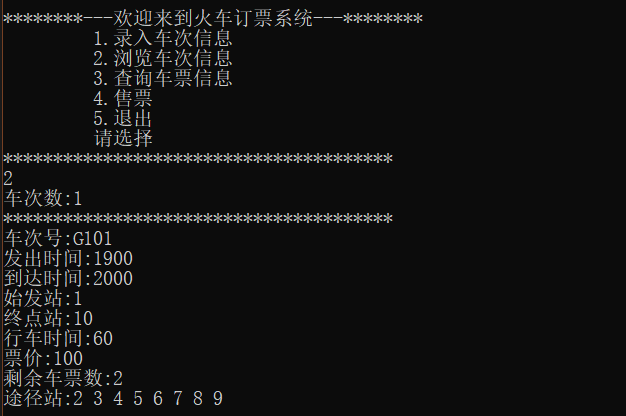
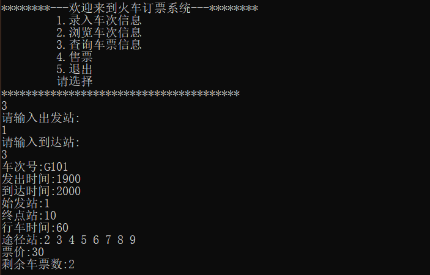
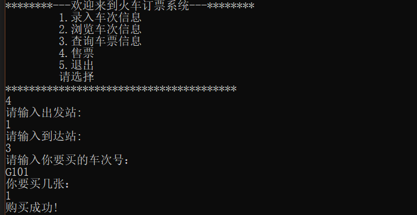
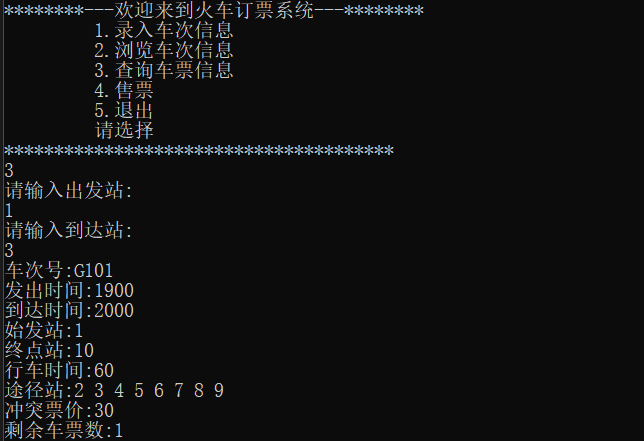
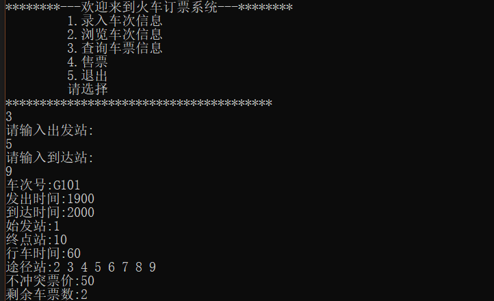

## 一、相关说明

本项目由VScode编译运行测试完成，下面第二点会用wsl-ubuntu运行介绍。

文件结构：

	- train.cpp  订票系统的内部逻辑以及函数的实现，同一车次可以买不同区间车票
	- trainrule和ticketrule实现了放票策略，脑洞大开随便写的，必然不是最优策略
	- train.h    存储火车车次信息，其中[last_ticket]字段表示列车容量
	- ticket.h   存储已购买车票信息，其中[last_ticket]字段表示买完该票后相同区间车票剩余数量

## 二、直接演示一遍使用流程

### （1）在文件根目录打开Linux-shell
[shift+鼠标右键]进行选择

### （2）用配置的g++直接编译运行
	g++ train.cpp
	./a.out
windows poweeshell会有乱码，需要在main函数添加 system("chcp 65001");
![[ScreenShot/编译启动程序.png]]
这里也可以根据build.sh脚本进行快速编译

### （3）录入车次信息
根据提示录入即可，这里直接展示结果文件和浏览信息。

由图可知我们的列车是G101，路线是1-2-3-4-5-6-7-8-9-10，需要注意的是不支持双向。

### （4）查询车票及购买
查询车票：我们的目的是买站1到站3的车票，可见G101满足条件输出，余票2张

购买车票：接着买一张站1到站3的票

查询余票：假设第2位客户也想要查询站1到站3的票，可见余票只有1张了

查询余票：假设第二位客户没有购买，第3位客户想要查询站5到站9的票，可见票数依然还有2张，这是因为站1-3和站5-9之间没有交叉，可理解为同一座位好段短途乘客就座，这就是该系统适配的放票原则。

